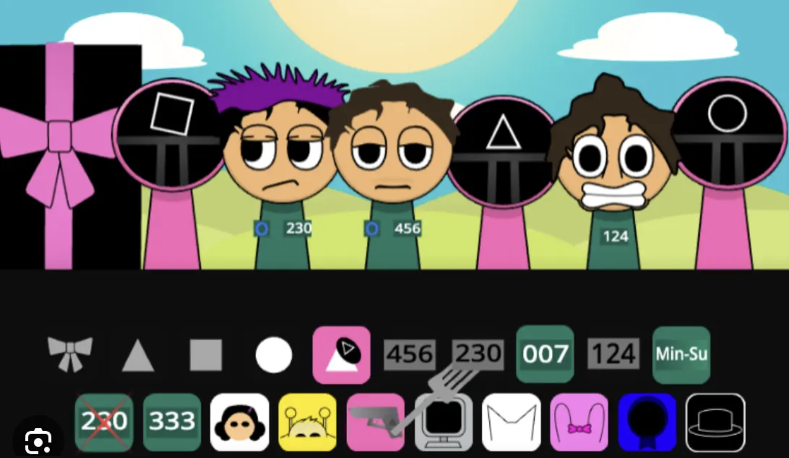

# Squidki - A Fan-Made Rhythm Survival Game

## 🎮 Game Overview

Squidki is a fan-made rhythm survival game that creatively combines the musical mechanics of Sprunki with the thrilling elimination challenges inspired by Squid Game. This unique fusion brings together rhythm-based gameplay with competitive survival elements, where players must create, mimic, or complete rhythm challenges within time limits to stay alive.

> ⚠️ **Note**: This is a fan project and is not affiliated with either Sprunki or Squid Game's official properties.

🌐 [Play Now](https://sprunkiretake.io/games/squidki)

## ✨ Core Gameplay

### Rhythm Challenges
- Create, mimic, or complete rhythm patterns within time limits
- Precision is crucial: rhythm deviations result in point deductions or elimination
- Progressive difficulty, adapting to new tempos, music styles, and obstacle patterns

### Survival Mechanics
- Dynamic Obstacles: Jump platforms synchronized with beats
- Battle System: Specific music styles can weaken opponents
- Stealth Mode: Use low-volume rhythms to avoid detection in certain scenarios

## 🎯 Game Modes

### Story Mode
- Solve puzzles and overcome obstacles through rhythm creation
- Unlock new instruments, sound effects, and narrative elements

### Multiplayer Battle
- Rhythm Replication: Perfectly mimic opponent's creations
- Improvisation: Create original rhythms under time pressure
- Genre Battles: Utilize different music styles to counter opponents

### Custom Creation
- Design original music using virtual instruments, sequencers, and sound libraries
- Share creations and challenge others on community leaderboards

## 🎨 Key Features

- Innovative Interface: Intuitive drag-and-drop music creation tools for all skill levels
- Progressive Difficulty: From basic rhythm matching to complex musical compositions
- Visual Effects: Neon-style environments with dynamic animations synced to gameplay
- Reward System: Unlock characters, skins, and abilities through victories or challenges

## 💻 Technical Support

- Platforms: Browser version (via Incredibox/Geometry Dash integration) and standalone Mobile/PC versions
- Controls:
  - Touch/Keyboard: Tap, swipe, or press keys to match rhythms
  - MIDI Support: Connect external devices for advanced composition

- Active community content (user-generated rhythms) popular on Reddit and Discord

> **Disclaimer**: Squidki is a fan-made project created for entertainment purposes only. All rights for Sprunki and Squid Game belong to their respective owners.
